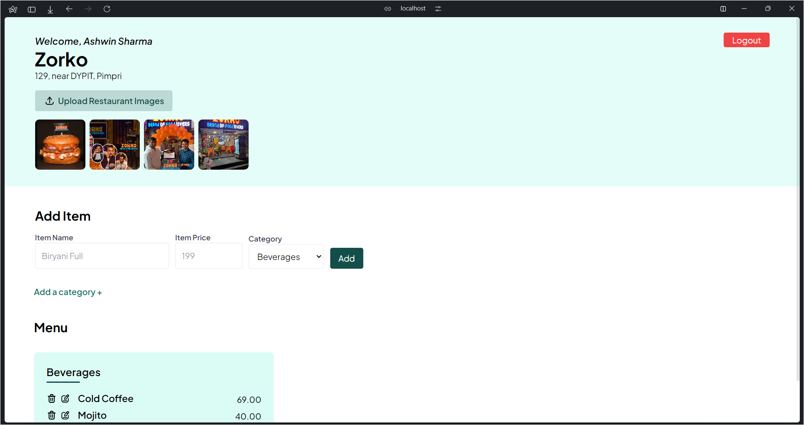

<!-- Basic README -->

# CuisineCraft🍽️

CuisineCraft is an application for managing restaurants' digital menus with ease

Made using PHP and PostgreSQL

## App Preview

<!-- add an image -->





## Features

- **Menu Management:** Add, edit, and delete menu items effortlessly.
- **User-Friendly Interface:** Simple and intuitive interface for seamless navigation.
- **Category Organization:** Categorize menu items for better organization.

## Coming Soon

- **Image Uploads:** Easily upload images for menu items to enhance visual appeal.
- Stay tuned for the live link to access CuisineCraft!

## Run the project locally

1. Install a PHP compatible stack (LAMP/WAMP/MAMP). [XAMPP](https://apachefriends.org/) is a good recommendation.

2. Clone this repository.

3. Create a PostgreSQL database named `cuisine-craft` on [Vercel](https://vercel.com/docs/storage/vercel-postgres)

4. Create a `.env` file in the root directory with the following content

```env
PG_URL='YOUR_PG_URL'
PG_OPTIONS='YOUR_PG_OPTIONS'
```

5. Run the project using [PHP Server](https://marketplace.visualstudio.com/items?itemName=brapifra.phpserver)

6. Access the application at `http://localhost:3000/index.php`
