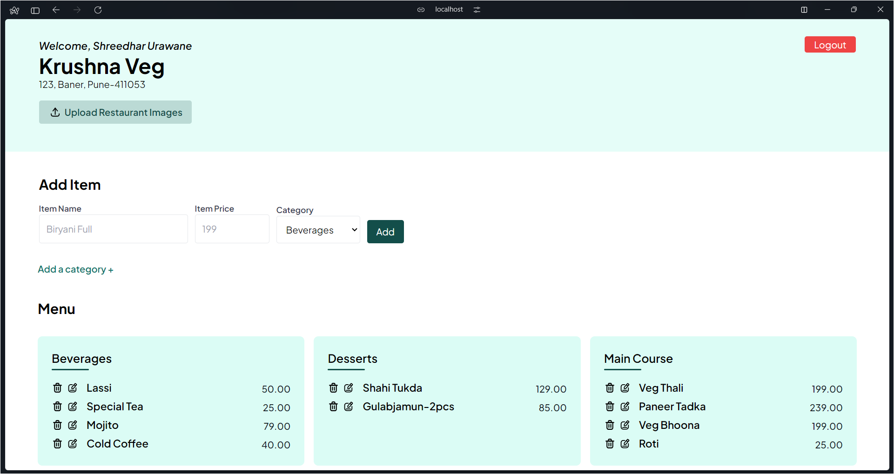

<!-- Basic README -->

# CuisineCraft🍽️

CuisineCraft is an application for managing restaurants' digital menus with ease.
Made using PHP and PostgreSQL

## App Preview

<!-- add an image -->

## Features

- **Menu Management:** Add, edit, and delete menu items effortlessly.
- **User-Friendly Interface:** Simple and intuitive interface for seamless navigation.
- **Category Organization:** Categorize menu items for better organization.

## Coming Soon

- **Image Uploads:** Easily upload images for menu items to enhance visual appeal.
- Stay tuned for the live link to access CuisineCraft!
