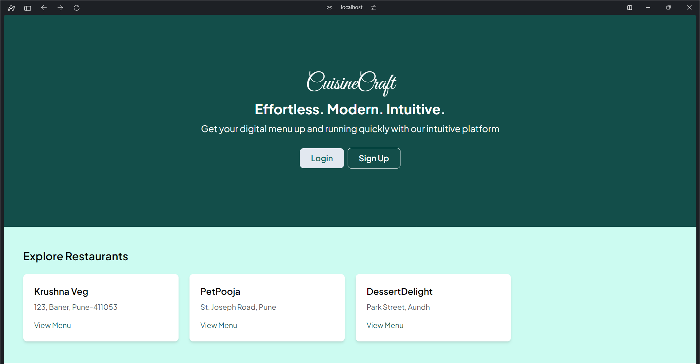

<!-- Basic README -->

# CuisineCraft

CuisineCraft is a PHP application for managing restaurants' digital menus with ease.

<!-- add an image -->

## Features

- **Menu Management:** Add, edit, and delete menu items effortlessly.
- **User-Friendly Interface:** Simple and intuitive interface for seamless navigation.
- **Category Organization:** Categorize menu items for better organization.
- **Image Uploads:** Easily upload images for menu items to enhance visual appeal.

## Coming Soon

Stay tuned for the live link to access CuisineCraft!
